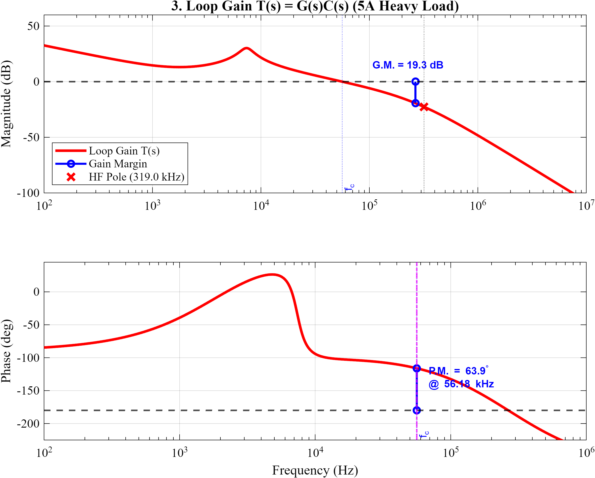
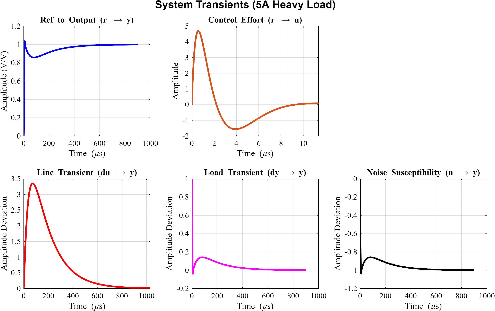

# Synchronous Buck PMIC — 5 V / 5 A


A synchronous buck power stage and its entire control/protection loop built from discrete components — no single-chip integrated PWM controller. The project covers the full design chain: power stage sizing, a hand-built Type III compensator, a discrete oscillator/PWM generator, gate drive, and six independent protection subsystems, verified through behavioral LTspice simulation and MATLAB loop-shaping.

| | |
|---|---|
| **Output** | 5 V @ 5 A (25 W) |
| **Input range** | 10.8 V – 22 V |
| **Switching frequency** | 450 kHz |
| **Gate driver** | LM5106 (high/low-side driver, discrete control logic around it) |
| **Control loop** | Analog Type III compensator, voltage-mode |
| **Tools** | LTspice, MATLAB, Altium Designer, Python |

## Why discrete instead of an off-the-shelf controller IC

The goal of this project was to understand and implement everything a buck PMIC controller IC normally hides — oscillator, PWM comparator, error amplifier/compensator, current sensing, fault logic, and sequencing — as separate, debuggable blocks. Every subsystem below was built, simulated, and iterated on individually before being integrated into the full loop.

## System architecture

The full control loop (`simulations/behavioural_model_complete.asc`) is organized into the following blocks:

- **Oscillator** — generates the 450 kHz timing reference for the PWM generator
- **PWM generator** — produces the final, masked PWM signal that drives the gate driver input
- **Type III compensator** — three-pole/two-zero analog compensator closing the voltage loop
- **Gate driver stage** — LM5106-based high/low-side drive with dead-time and FCCM mode currently implemented; DEM/ZCD-based mode switching is planned but not yet active
- **Soft start** — controlled ramp-up of the output to limit inrush
- **SCP/OCP** — short-circuit and overcurrent protection via valley current sensing (INA181 current-sense amp + low-side sense resistor)
- **Hiccup mode protection** — RC-accumulator-based hiccup logic for sustained fault conditions
- **OVP** — output overvoltage protection using a bistable PNP/NPN latch driving a PMOS series disconnect switch
- **UVLO** — input undervoltage lockout with hysteresis
- **Over-temperature protection** — NTC-based thermal cutoff

A separate, expanded schematic (`simulations/digital_arhcitecture.asc`) breaks the same architecture out further, including the reverse-polarity protection front end and debug GPIO/LED indicators.

### Protection architecture (tiered)

1. **Tier 1 — Max on-time clamp**: hard upper bound on high-side conduction time
2. **Tier 2 — Valley current limiting**: cycle-by-cycle current limit via low-side sense resistor and a D flip-flop
3. **Tier 3 — Hiccup mode**: RC-accumulator trips a full shutdown/retry cycle under sustained overcurrent
4. Input UVLO/OVP, reverse polarity protection, latching output OVP and NTC over-temperature protection.

## Control loop design

The compensator was tuned in MATLAB (`simulations/MATLAB_code/Compensator_tuner_results_and_interpretations.m`) by extracting the plant transfer function from the power stage, designing a Type III compensator, and computing loop gain `T(s) = G(s)·C(s)` across the full load range:

- Very light load (µA)
- Light load (100 mA)
- Heavy load (5 A)

For each load case the script produces five plots: power-stage plant response, compensator response, loop gain with gain/phase margin annotations, an overlay of all three, and closed-loop transient response (reference step, control effort, line transient, load transient, and noise susceptibility). Full results for all three load cases are in `simulations/graphs_or_pdfs/` and `simulations/pictures/`.

**Loop gain — 5 A heavy load:**



**Closed-loop transient response — 5 A heavy load:**



The loop was checked for adequate gain and phase margin at all three load extremes, not just the nominal operating point, since a Type III compensator tuned only for one load can lose margin badly at the others.

## LTspice verification

The behavioral model (`simulations/behavioural_model_complete.asc`) simulates the full system — oscillator through gate drive through protection logic — using switch-based MOSFET models (`LS_MOS`, `HS_MOS`) for fast iteration, with separate standalone testbenches for individual protection blocks:

- `OVP_test.asc` — overvoltage latch and PMOS disconnect
- `UVLO_protection.asc` — undervoltage lockout behavior
- `oscillator.asc` — standalone oscillator verification
- `compensator_and_plant.asc` — open-loop plant + compensator check before closing the loop

A significant debugging effort went into the zero-current detection comparator (TLV3501), which was prone to retriggering/chatter around the zero crossing. This was resolved with a hysteresis feedback resistor, latching the comparator output until the next PWM cycle, and analog leading-edge blanking — all documented as in-schematic notes at the relevant nodes.

## MOSFET selection pipeline (`Mosfet_extraction_pipeline/`)

Rather than hand-picking MOSFETs from datasheets, this is a small automated pipeline for narrowing a large parts catalog down to candidates that fit the LM5106 drive parameters:

1. **`digikey_mosScraper.py`** / **`mouser_mosScrapper.py`** — pull candidate MOSFET part numbers and datasheet links from Digi-Key and Mouser APIs into `excel_sheets/mosfet_urls.xlsx`
2. **`gemini_mosfet_data_extractor.py`** — uses the Gemini API (with a Pydantic-validated structured output schema and API-key rotation for throughput) to extract Rds(on), gate charge (Qg, Qsw), and package data directly from each datasheet PDF
3. **`excel_cleanup.py`** — normalizes and cleans the extracted numeric fields
4. **`JK_optimiser_HS.py`** / **`JK_optimiser_LS.py`** — score and rank candidates for the high-side and low-side switch positions against the actual drive conditions (V_IN = 22 V, V_OUT = 5 V, I_OUT = 5 A, I_PP = 1.5 A, V_DRIVE = 10 V) and the LM5106's peak source/sink current, producing `High_side_frequency_optimization_matrix_LM5106.xlsx` and `low_side_frequency_matrix_LM5106.xlsx`. Equivalent matrices for the UCC27282 driver are included for comparison.
5. **`check_models.py`** — utility to verify which Gemini models are available/callable with the configured API key

Passive component selection (output capacitors) was similarly datasheet-driven — see `simulations/pictures/MLCC_cap_selection.png` and the DC-bias/temperature derating curves for the chosen output capacitor bank.

## PCB

`Sync_buck_convertor/Sync_buck_convertor.PrjPcb` is the Altium project file for the physical board. Schematic and layout files are excluded from version control (see `.gitignore`) while layout is in progress.

## Repository structure

```
Synchronous_buck_PMIC/
├── Mosfet_extraction_pipeline/     # Automated MOSFET sourcing, extraction, and ranking
│   ├── digikey_mosScraper.py
│   ├── mouser_mosScrapper.py
│   ├── gemini_mosfet_data_extractor.py
│   ├── excel_cleanup.py
│   ├── JK_optimiser_HS.py
│   ├── JK_optimiser_LS.py
│   ├── check_models.py
│   └── excel_sheets/                # Scraped/cleaned MOSFET data + selection matrices
├── Sync_buck_convertor/             # Altium project (schematic/PCB not yet public)
├── simulations/
│   ├── behavioural_model_complete.asc   # Full system LTspice model
│   ├── behavioural_model_bare.asc
│   ├── digital_arhcitecture.asc         # Expanded architecture with protection detail
│   ├── compensator_and_plant.asc        # Open-loop plant + compensator
│   ├── oscillator.asc
│   ├── OVP_test.asc
│   ├── UVLO_protection.asc
│   ├── MATLAB_code/                     # Compensator tuning across all load cases
│   ├── graphs_or_pdfs/                  # Bode/transient plots, PDF versions
│   └── pictures/                        # Bode/transient plots, PNG + component derating curves
├── LICENSE                          # MIT (code / scripts)
└── LICENSE-CERN-OHL-P-2.0.txt       # CERN-OHL-P (hardware design files)
```

## License

Code (Python, MATLAB) is under the **MIT License**. Hardware design files (schematics, PCB layout) are under **CERN-OHL-P v2**. See `LICENSE` and `LICENSE-CERN-OHL-P-2.0.txt`.

This repository is a static portfolio archive — see `CONTRIBUTING.md` for the contribution policy (issues for critical errors are welcome; PRs are not being accepted).
