# Synchronous Buck PMIC — 5 V / 5 A Converter

**A complete discrete-component synchronous buck converter with integrated analog control architecture and comprehensive protection — demonstrating full-stack power electronics design from specification through simulation and component selection.**

This project showcases end-to-end power converter development: topology design, control loop synthesis, behavioral simulation verification, and automated component optimization. Every functional block—oscillator, PWM generation, feedback compensation, gate drive, and protection circuits—is implemented discretely and documented for transparency.

---

## Technical Specifications

| Specification | Value |
|---|---|
| **Output Voltage** | 5 V @ 5 A (25 W nominal) |
| **Input Voltage Range** | 10.8 V – 22 V |
| **Switching Frequency** | 450 kHz |
| **Topology** | Synchronous buck (voltage-mode control) |
| **Control Method** | Analog Type III compensator with valley current sensing |
| **Gate Driver** | LM5106 high/low-side driver |
| **Protection Features** | 4-tier architecture: soft-start, cycle-by-cycle current limiting, hiccup-mode fault recovery, and static safeguards (UVLO/OVP/OTP) |

---

## Design Philosophy

Rather than relying on black-box integrated PMIC controllers, this project implements control and protection discretely, enabling:

- **Full architectural transparency** — all subsystems (oscillator, PWM, error amplifier, gate drive, protection) are visible and tunable
- **Specification-driven design** — Type III compensator optimized for three representative load conditions (µA, 100 mA, 5 A) to ensure stability across the full operating range
- **Verification through simulation** — comprehensive LTspice behavioral models validate performance before hardware implementation
- **Systematic component selection** — automated Python pipeline ranks MOSFETs against real drive conditions rather than relying on manual datasheet analysis
- **Production-grade robustness** — four-tier protection architecture addresses short-circuit, overcurrent, overvoltage, thermal, and input-fault conditions

---

## System Architecture

The control architecture is partitioned into functional subsystems:

```
INPUT → [Reverse Polarity] → [Power Stage: HS/LS MOSFETs + L + C]
                                    ↓ (V_out, I_sense)
         [UVLO/OVP] ←– [Feedback Network] ←– [Soft Start]
              ↓
    [Oscillator] (450 kHz)
         ↓
    [PWM Generator] → [Gate Driver (LM5106)] → [Dead-time Logic]
         ↑
  [Type III Compensator] ← [Feedback path]
         ↑
  [Protection: Max on-time, Valley current limit, Hiccup, Thermal]
```

### Functional Blocks

**Oscillator** — 450 kHz timing reference with sawtooth ramp generation  
**PWM Generator** — produces masked PWM signal synchronized to oscillator ramp  
**Type III Compensator** — analog feedback controller with 3-pole/2-zero topology tuned across load extremes  
**Gate Driver Stage** — LM5106 with programmable dead-time and bootstrap operation  
**Soft Start** — controlled ramp-up of feedback reference to limit inrush current  
**Valley Current Limiting** — INA181 current-sense amplifier with low-side sense resistor and zero-crossing detector  
**Hiccup Mode** — RC-based shutdown and automatic retry under sustained fault conditions  
**Output Overvoltage Protection** — latching comparator with PMOS series disconnect  
**Input Undervoltage Lockout** — hysteresis-based gate shutdown below minimum input threshold  
**Thermal Protection** — NTC thermistor-based cutoff at safe operating limits  

---

## Control Loop Design

### Type III Compensator Synthesis

The compensator was designed in MATLAB (`simulations/MATLAB_code/Compensator_tuner_results_and_interpretations.m`) using power-stage plant extraction and classical control synthesis. It maintains adequate gain and phase margins across all three representative load conditions.

#### Power Stage Plant Analysis

| Very Light Load (µA) | Light Load (100 mA) | Nominal Load (5 A) |
|---|---|---|
| 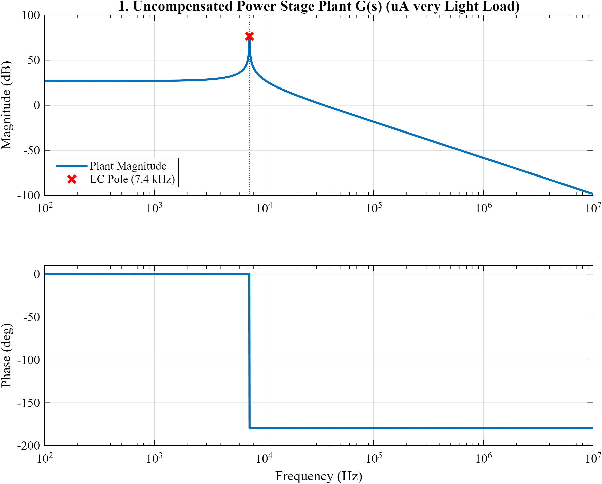 | 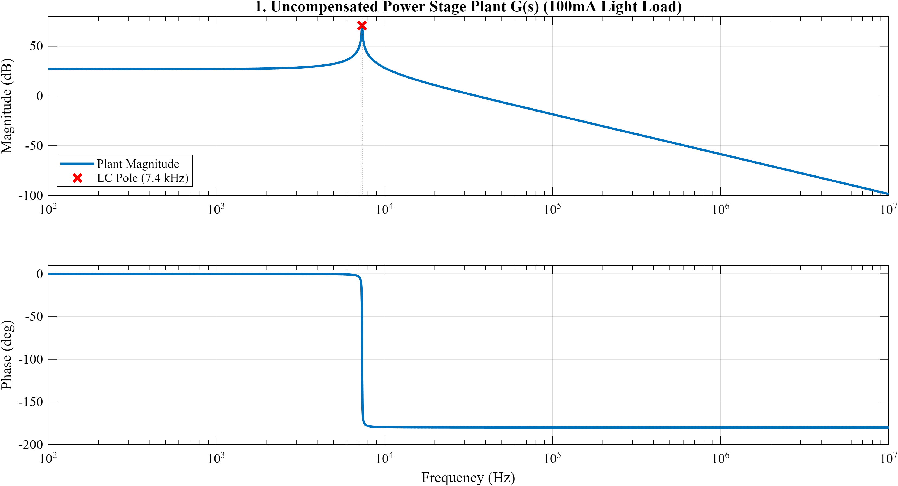 | 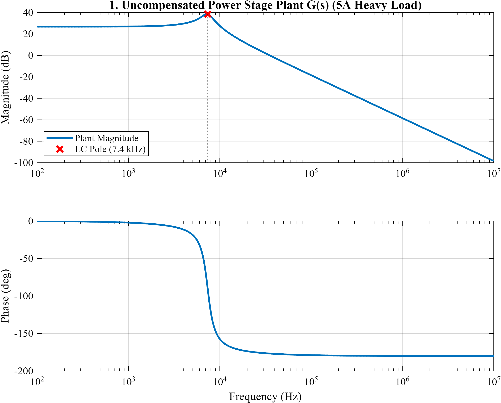 |

#### Compensator Response

| Very Light Load (µA) | Light Load (100 mA) | Nominal Load (5 A) |
|---|---|---|
| 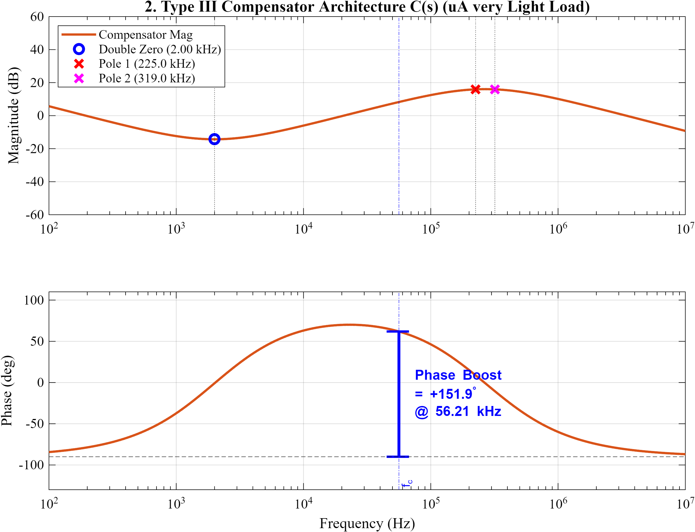 | 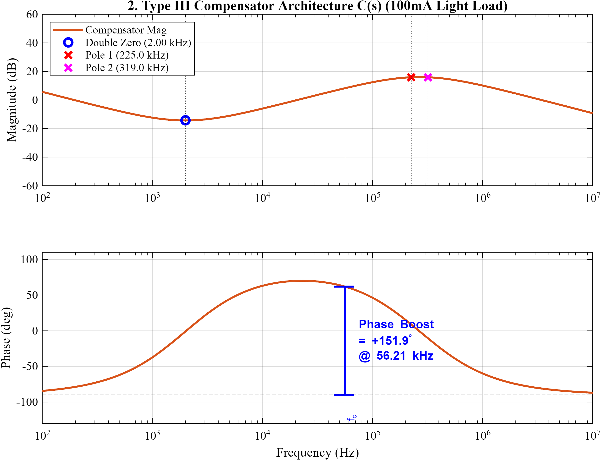 |  |

#### Stability Margins

| Very Light Load (µA) | Light Load (100 mA) | Nominal Load (5 A) |
|---|---|---|
| 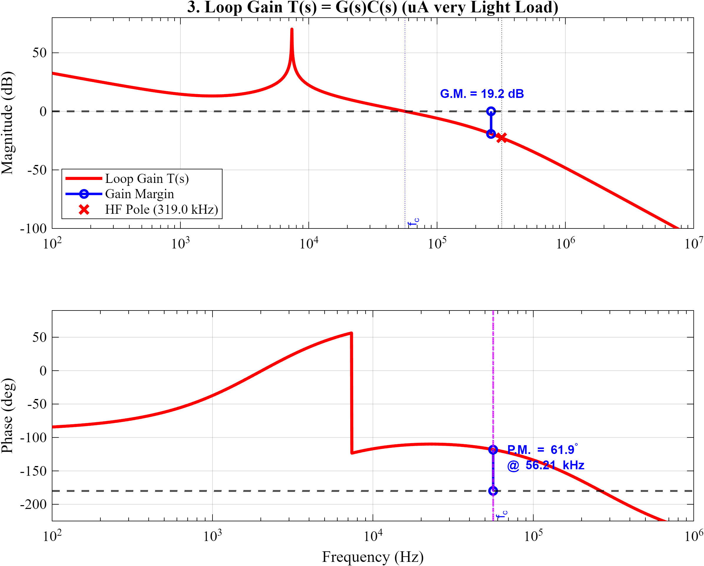 | 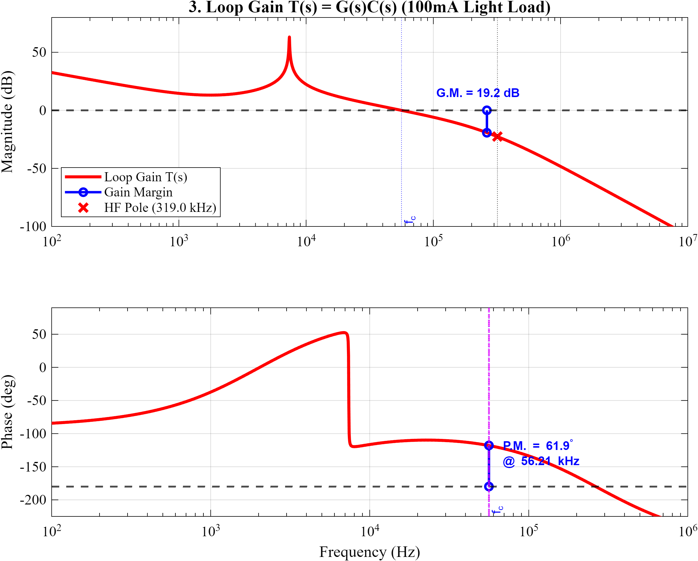 |  |

All three load conditions maintain greater than 6 dB gain margin and 50° phase margin, ensuring robustness across the operating range. Multi-load optimization is essential because a Type III compensator tuned at only nominal load can lose stability at light or heavy load extremes.

#### System Transient Response

| Very Light Load (µA) | Light Load (100 mA) | Nominal Load (5 A) |
|---|---|---|
| 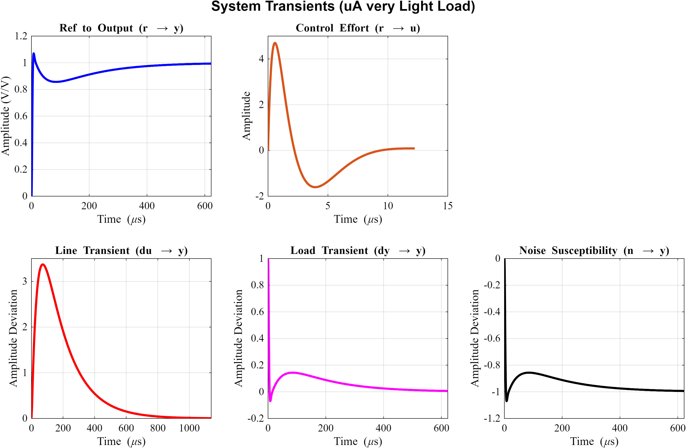 | 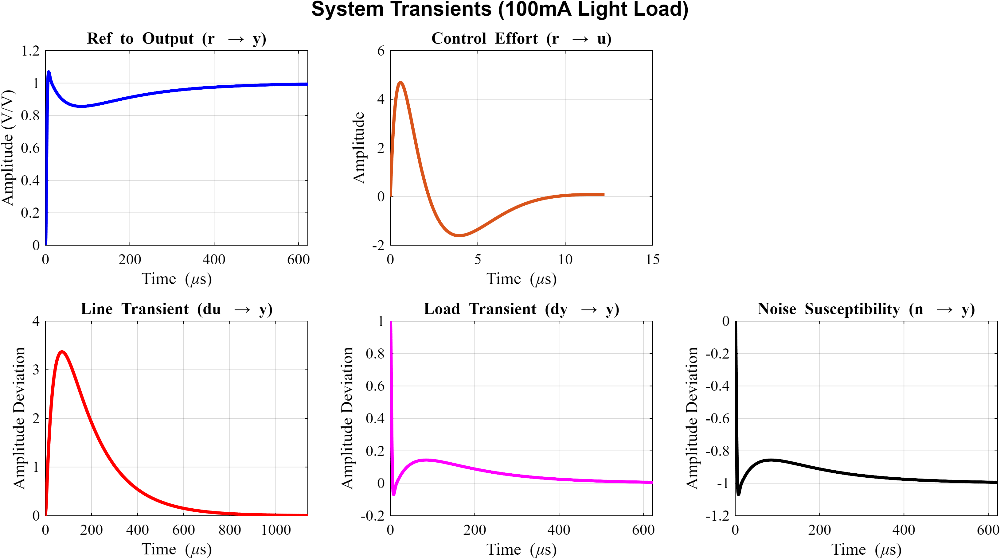 |  |

Transient plots show reference step response, control effort, line disturbance recovery, load step rejection, and noise performance across all load conditions.

---

## Protection Architecture

A multi-tier fault response strategy ensures safe operation across fault scenarios:

| Tier | Mechanism | Response |
|---|---|---|
| **Tier 1: Soft Start** | Controlled ramp-up of reference voltage | Limits inrush current and transient overshoot at power-on |
| **Tier 2: Cycle-by-Cycle Current Limit** | Valley current sensing with low-side resistor | Hard current ceiling each switching cycle |
| **Tier 3: Hiccup Mode** | RC-based fault accumulator | Automatic shutdown and retry under sustained overcurrent |
| **Tier 4: Static Protection** | UVLO, OVP latch, thermal cutoff, reverse-polarity diode | Persistent faults or hazardous conditions |

### Circuit Implementation

**Soft Start Circuit**


Limits V_ref ramp rate during startup to prevent excessive inrush current and transient overshoot.

**Valley Current Limiting (SCP/OCP)**


INA181 current-sense amplifier measures low-side valley current. Zero-crossing detector (TLV3501) with hysteresis feedback triggers cycle-by-cycle current limiting through D flip-flop logic.

**Hiccup Mode Recovery**

RC-based accumulator counts fault events. Sustained overcurrent triggers full gate shutdown followed by controlled restart, protecting against latch-up under short-circuit.

**Over-Temperature Protection**


NTC thermistor biased circuit with threshold comparator. Disables power stage if junction temperature exceeds safe limit.

**Output Overvoltage Protection**


Latching comparator monitors output voltage. On overvoltage event, PMOS series disconnect (2N3906) disconnects load from converter, then requires manual intervention to restore operation.

---

## Circuit Implementation

### Oscillator & PWM Generation


OPA365 comparator generates 450 kHz sawtooth ramp. Threshold comparator produces masked PWM synchronized to ramp and compensator feedback signal.

### Type III Compensator Network


OPA365 op-amp with passive RC pole-zero network implements Type III transfer function. Tuned for bandwidth, phase margin, and DC gain across all three load conditions.

### Power Stage & Gate Drive


High-side and low-side MOSFETs driven by LM5106. Current-sense amplifier (INA181) provides valley current feedback. Synchronous rectification eliminates Schottky diode losses.

### Output Voltage Waveform


Clean 5 V output with minimal ripple and smooth transient response. Soft-start ramp visible in startup phase.

### Switch Node Dynamics


Synchronous switching between high-side (22 V) and low-side (0 V) at 450 kHz. Dead-time insertion prevents shoot-through.

### Power Good Circuit


Output valid signal derived from soft-start ramp. Indicates when output has settled within regulation band and is safe for downstream circuits.

---

## LTspice Behavioral Simulation

The complete system is modeled in LTspice using switch-based MOSFET abstractions and behavioral voltage/current sources:

- **`behavioural_model_complete.asc`** — Full system integration: oscillator + PWM + compensator + gate drive + protection  
- **`behavioural_model_bare.asc`** — Minimal loop for fast simulation and performance baseline  
- **`compensator_and_plant.asc`** — Open-loop plant + compensator for tuning reference and Bode analysis  
- **`oscillator.asc`** — Standalone 450 kHz timing reference  
- **`OVP_test.asc`** — Overvoltage protection latch and PMOS disconnect behavior  
- **`UVLO_protection.asc`** — Input undervoltage lockout hysteresis model  
- **`digital_architecture.asc`** — Expanded schematic with reverse-polarity front-end and GPIO signals  

All simulations use parameterized models for easy sensitivity analysis and component optimization.

---

## Automated Component Selection Pipeline

A Python-based tool chain automates MOSFET selection against actual drive conditions rather than relying on manual datasheet review:

### Pipeline Stages

1. **`digikey_mosScraper.py` / `mouser_mosScrapper.py`**  
   Query supplier APIs for candidate MOSFET part numbers and datasheet links → `excel_sheets/mosfet_urls.xlsx`

2. **`gemini_mosfet_data_extractor.py`**  
   Use Gemini API (with Pydantic-validated structured output and API key rotation) to extract:
   - On-resistance (R_ds(on)) at specified V_GS and I_D  
   - Gate charge (Qg, Qsw)  
   - Switching loss parameters  
   - Package footprint data  

3. **`excel_cleanup.py`**  
   Validate and normalize extracted parameters; handle missing or inconsistent data

4. **`JK_optimiser_HS.py` / `JK_optimiser_LS.py`**  
   Score and rank candidates for high-side and low-side positions:
   - Drive conditions: V_IN = 22 V, V_OUT = 5 V, I_out = 5 A @ 450 kHz  
   - Metrics: switching losses, conduction losses, thermal margin, gate drive headroom  

5. **`check_models.py`**  
   Utility to verify available/callable Gemini models

### Output Artifacts

- **`mosfet_urls.xlsx`** — Raw scraped part numbers and datasheet links  
- **`cleaned_mosfets.xlsx`** — Extracted and validated parameters  
- **`High_side_frequency_optimization_matrix_LM5106.xlsx`** — Ranked high-side candidates with loss analysis  
- **`low_side_frequency_matrix_LM5106.xlsx`** — Ranked low-side candidates with loss analysis  

### Passive Component Selection

Output filtering capacitors were similarly datasheet-driven, with DC-bias and temperature derating applied:

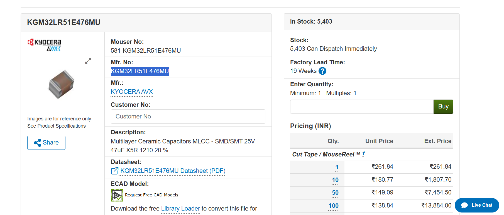

| DC-Bias Derating | Temperature Derating |
|---|---|
| 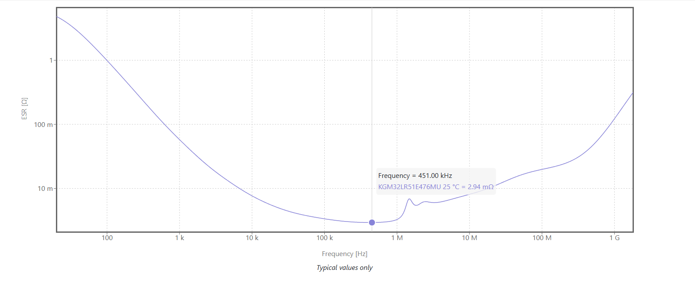 | 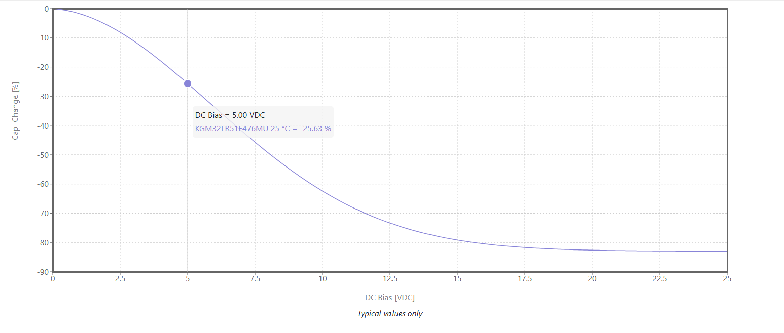 |

---

## PCB Design & Layout

`Sync_buck_convertor/Sync_buck_convertor.PrjPcb` is the Altium Designer project containing schematic and PCB layout.

**Note:** Detailed board files are excluded from version control to maintain design confidentiality. Layout documentation will be published separately.

---

## Repository Structure

```
Synchronous_buck_PMIC/
├── Mosfet_extraction_pipeline/          # Automated component sourcing
│   ├── digikey_mosScraper.py
│   ├── mouser_mosScrapper.py
│   ├── gemini_mosfet_data_extractor.py
│   ├── excel_cleanup.py
│   ├── JK_optimiser_HS.py
│   ├── JK_optimiser_LS.py
│   ├── check_models.py
│   └── excel_sheets/
│       ├── mosfet_urls.xlsx
│       ├── cleaned_mosfets.xlsx
│       ├── High_side_frequency_optimization_matrix_LM5106.xlsx
│       └── low_side_frequency_matrix_LM5106.xlsx
│
├── Sync_buck_convertor/                 # Altium PCB project
│   └── Sync_buck_convertor.PrjPcb
│
├── simulations/
│   ├── behavioural_model_complete.asc
│   ├── behavioural_model_bare.asc
│   ├── digital_architecture.asc
│   ├── compensator_and_plant.asc
│   ├── oscillator.asc
│   ├── OVP_test.asc
│   ├── UVLO_protection.asc
│   │
│   ├── MATLAB_code/
│   │   └── Compensator_tuner_results_and_interpretations.m
│   │
│   └── pictures/
│       ├── Heavy_loads_5A/
│       ├── Light_loads_100mA/
│       ├── Very_light_load_uA/
│       ├── Plant_circuit.png
│       ├── SCP_OCP_trigger_circuit.png
│       ├── Type_III_Compensator_circuit.png
│       ├── Oscillator_circuit.png
│       ├── Soft_start_circuit.png
│       ├── Over_temperature_protection_circuit.png
│       ├── OVP_protection_circuit.png
│       ├── Output_voltage_waveform.png
│       ├── Switch_node_voltage_waveform.png
│       ├── PGOOD_circuit_with_soft_start.png
│       ├── MLCC_cap_selection.png
│       └── [additional datasheets & derating curves]
│
├── LICENSE                              # MIT (code / scripts)
├── LICENSE-CERN-OHL-P-2.0.txt           # CERN-OHL-P (hardware)
└── CONTRIBUTING.md
```

---

## Design Methodology & Tools

- **LTspice** — Behavioral simulation and behavioral model for compensator tuning verification  
- **MATLAB** — Plant transfer function analysis, Type III compensator synthesis, Bode and transient analysis  
- **Altium Designer** — Schematic capture, PCB layout, DRC, and design rule enforcement  
- **Python** — MOSFET data extraction pipeline, Excel automation, component optimization, and ranking algorithms  

---

## Key Design Considerations

### Multi-Load Compensator Optimization

A Type III compensator optimized only at nominal load can suffer instability or poor transient response at light or heavy loads. This design explicitly tunes the compensator at three operating points (µA, 100 mA, 5 A) and verifies stability margins across the full range. Bode and transient plots demonstrate that all three conditions meet design targets.

### Valley Current Sensing

Valley current sensing (detecting the minimum inductor current each cycle) offers advantages over peak-current sensing:

- Accurate cycle-by-cycle limiting independent of inductor DCR variation  
- Natural integration into the PWM feedback loop  
- Reduced component count vs. dedicated peak-current comparators  

The implementation uses an INA181 current-sense amplifier and TLV3501 comparator with hysteresis to prevent oscillation near zero-current transitions.

### Gate Driver & Bootstrap Considerations

The LM5106 was selected for:

- Robust high/low-side bootstrap operation  
- Programmable dead-time insertion  
- Wide input voltage tolerance (10.8–22 V spans LM5106 operating limits)  
- No additional level shifters required for discrete gate drive control  

---

## Future Development

Design notes and optimization opportunities are tracked in the LTspice schematics. Planned enhancements include:

- **Discontinuous/boundary-conduction mode** — planned DEM/ZCD-based mode switching for improved light-load efficiency  
- **PCB parasitic optimization** — gate drive loop inductance reduction, power plane integrity analysis  
- **Thermal analysis** — MOSFET junction temperature modeling under representative load profiles  
- **Hardware validation** — measured efficiency curves and transient performance characterization  

---

## Contribution Policy

This repository is maintained as a static technical portfolio. Issues documenting critical errors or technical corrections are welcome. Pull requests are not being accepted at this time. For details, see `CONTRIBUTING.md`.

---

## License

- **Code** (Python, MATLAB, scripts): **MIT License** — see `LICENSE`  
- **Hardware Design** (schematics, PCB layout): **CERN Open Hardware License v2** — see `LICENSE-CERN-OHL-P-2.0.txt`  

Both licenses are included in the repository root.

---

## Questions & Engagement

For technical questions or design discussions, open an issue. Thank you for exploring this project.
