--Work in progress--


# Synchronous Buck PMIC — 5 V / 5 A Converter

**A complete discrete-component synchronous buck converter with integrated analog control architecture and comprehensive protection — demonstrating full-stack power electronics design from specification through simulation and component selection.**

This project showcases end-to-end power converter development: topology design, control loop synthesis, behavioral simulation verification, and automated component optimization. Every functional block—oscillator, PWM generation, feedback compensation, gate drive, and protection circuits—is implemented discretely and documented for transparency.

---

## Technical Specifications

| Specification | Value |
|---|---|
| **Output Voltage** | 5 V @ 5 A (25 W nominal) |
| **Input Voltage Range** | 10.8 V – 22 V |
| **Switching Frequency** | 450 kHz |
| **Topology** | Synchronous buck (voltage-mode control) |
| **Control Method** | Analog Type III compensator with valley current sensing |
| **Gate Driver** | LM5106 high/low-side driver |
| **Protection Features** | 4-tier architecture: soft-start, cycle-by-cycle current limiting, hiccup-mode fault recovery, and static safeguards (UVLO/OVP/OTP) |

---

## Design Philosophy

Rather than relying on black-box integrated PMIC controllers, this project implements control and protection discretely, enabling:

- **Full architectural transparency** — all subsystems (oscillator, PWM, error amplifier, gate drive, protection) are visible and tunable
- **Specification-driven design** — Type III compensator optimized for three representative load conditions (µA, 100 mA, 5 A) to ensure stability across the full operating range
- **Verification through simulation** — comprehensive LTspice behavioral models validate performance before hardware implementation
- **Systematic component selection** — automated Python pipeline ranks MOSFETs against real drive conditions rather than relying on manual datasheet analysis
- **Production-grade robustness** — four-tier protection architecture addresses short-circuit, overcurrent, overvoltage, thermal, and input-fault conditions

---

## System Architecture

The control architecture is partitioned into functional subsystems:

```
INPUT → [Reverse Polarity] → [Power Stage: HS/LS MOSFETs + L + C]
                                    ↓ (V_out, I_sense)
         [UVLO/OVP] ←– [Feedback Network] ←– [Soft Start]
              ↓
    [Oscillator] (450 kHz)
         ↓
    [PWM Generator] → [Gate Driver (LM5106)] → [Dead-time Logic]
         ↑
  [Type III Compensator] ← [Feedback path]
         ↑
  [Protection: Max on-time, Valley current limit, Hiccup, Thermal]
```

The protection and sequencing blocks in that last row are the ones migrating into the CPLD supervisor; the inner voltage loop stays analog.

### Functional Blocks

**Oscillator** — 450 kHz timing reference with sawtooth ramp generation  
**PWM Generator** — produces masked PWM signal synchronized to oscillator ramp  
**Type III Compensator** — analog feedback controller with 3-pole/2-zero topology tuned across load extremes  
**Gate Driver Stage** — LM5106 with programmable dead-time and bootstrap operation  
**Soft Start** — controlled ramp-up of feedback reference to limit inrush current  
**Valley Current Limiting** — INA181 current-sense amplifier with low-side sense resistor and zero-crossing detector  
**Hiccup Mode** — RC-based shutdown and automatic retry under sustained fault conditions  
**Output Overvoltage Protection** — latching comparator with PMOS series disconnect  
**Input Undervoltage Lockout** — hysteresis-based gate shutdown below minimum input threshold  
**Thermal Protection** — NTC thermistor-based cutoff at safe operating limits  

All blocks are implemented in the LTspice schematics under `simulations/`.

---

## Control Loop Design

### Type III Compensator Synthesis

The compensator was designed in MATLAB using power-stage plant extraction and classical control synthesis. It maintains adequate gain and phase margins across all three representative load conditions — critical since a Type III optimised at only nominal load can lose stability at the light-load extreme, as this project found out the hard way (see [Design History](#design-history-why-the-compensator-was-retuned)).

#### Reproducing the analysis

`Compensator_tuner_results_and_interpretations.m` is a **plotting and margin-extraction script, not a standalone design script.** It expects `G` (plant), `C` (compensator), and the `IOTransfer_*` closed-loop objects to already exist in the workspace. Those come from the saved Control System Designer sessions:

| Session file | Operating point |
|---|---|
| `Compensator_tuning_session_very_light_load_uA.mat` | µA load |
| `Compensator_tuning_session_light_load_(100ma).mat` | 100 mA load |
| `Compensator_tuning_session_heavy_load_(5A).mat` | 5 A load |
| `Compensator_tuning_session_old.mat` | Superseded — see [Design History](#design-history-why-the-compensator-was-retuned) |

To regenerate a figure set:

```matlab
load('Compensator_tuning_session_heavy_load_(5A).mat')   % defines G, C, IOTransfer_*
Run_Name = '5A_Heavy_Load';                              % must match, it names the exports
Compensator_tuner_results_and_interpretations
```

The script writes both a 300 dpi `.png` and a vector `.pdf` for each of the five figures — the PNGs are what this README embeds, the PDFs are the LaTeX-ready copies under `graphs_or_pdfs/`.

#### Power Stage Plant Analysis

| Very Light Load (µA) | Light Load (100 mA) | Nominal Load (5 A) |
|---|---|---|
|  |  |  |

**Plant gain, poles, and zeros extracted via MATLAB transfer function analysis. Critical for compensator design tuning across all three load points.**

#### Compensator Frequency Response

| Very Light Load (µA) | Light Load (100 mA) | Nominal Load (5 A) |
|---|---|---|
|  |  |  |

**Type III compensator Bode magnitude and phase. Designed to provide adequate gain while ensuring phase margin across all load points.**

#### Closed-Loop Stability Margins

| Very Light Load (µA) | Light Load (100 mA) | Nominal Load (5 A) |
|---|---|---|
|  |  |  |

**Loop gain T(jω) with margins annotated by `margin()` in MATLAB. Crossover sits at ~56 kHz — roughly f_sw/8 — in all three cases, and the high-frequency compensator pole lands at 319 kHz below the switching frequency:**

| Load | Gain margin | Phase margin | Crossover f_c |
|---|---|---|---|
| Very light (µA) | 19.2 dB | 61.9° | 56.21 kHz |
| Light (100 mA) | 19.2 dB | 61.9° | 56.21 kHz |
| Nominal (5 A) | 19.3 dB | 63.9° | 56.18 kHz |

**The margins barely move across five decades of load current — that invariance is the design goal, not the absolute numbers. What does change is the LC double-pole peak visible in the magnitude plots: heavily damped by the load resistor at 5 A, sharp and high-Q in the µA case. The compensator is shaped to tolerate the worst of those.**

#### System Overlay Comparison

| Very Light Load (µA) | Light Load (100 mA) | Nominal Load (5 A) |
|---|---|---|
| 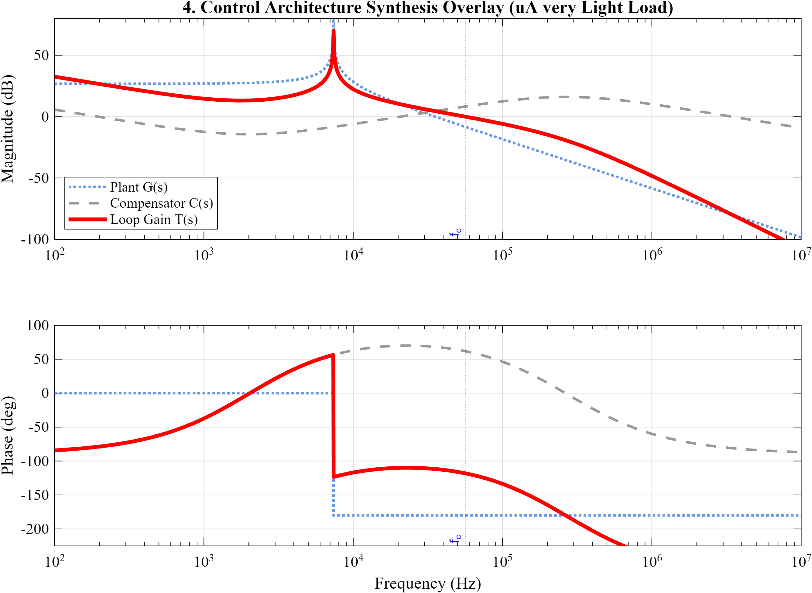 | 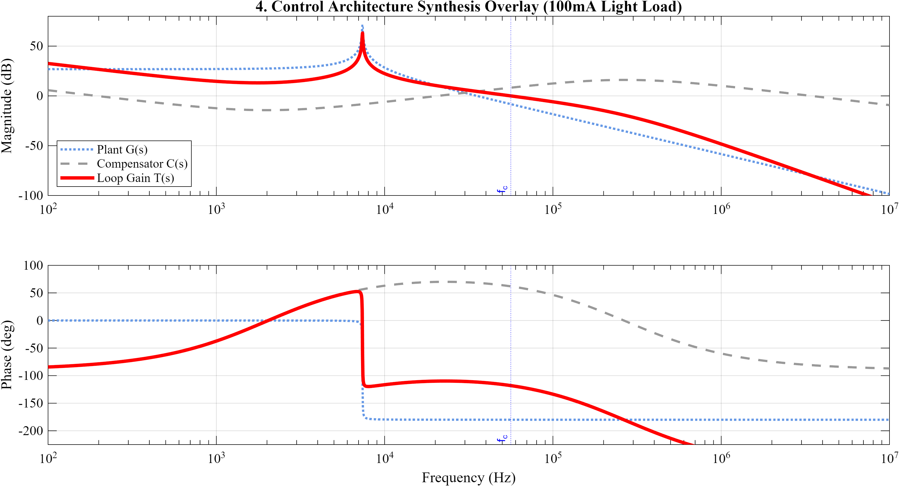 | 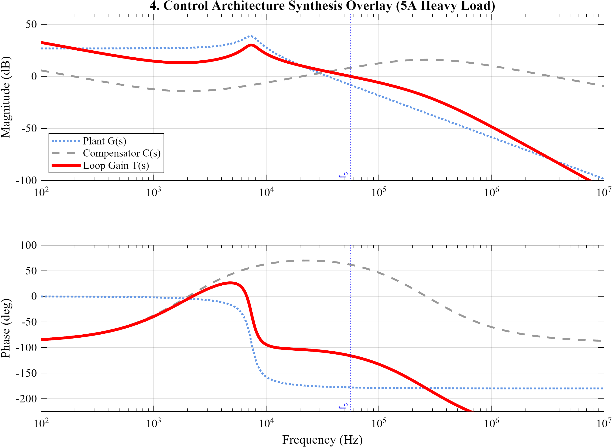 |

**Plant G(s), compensator C(s), and loop gain T(s) = G(s)C(s) on one axis, showing how the compensator's gain shaping places crossover and allocates margin. The plant's LC peak sharpening from left to right is what the compensator has to absorb.**

#### Transient Response

| Very Light Load (µA) | Light Load (100 mA) | Nominal Load (5 A) |
|---|---|---|
|  |  |  |

**System transient response showing: reference step tracking, control effort (compensator output), line disturbance recovery (V_in step), load transient rejection (I_out step), and noise susceptibility across all three load extremes.**

---

## Design History: Why the Compensator Was Retuned

`old_vernon_k_tuner/` and `old_vernon_k_tuner_results/` hold a **superseded compensator design**, kept deliberately because the failure is more instructive than the fix.

**The original approach** tuned the Type III network with the K-factor method against the plant at a single operating point. On paper it looked healthy — **21.8 dB gain margin, 60.2° phase margin at 56.21 kHz crossover**, margins comparable to the design that replaced it.

**What the single-point analysis hid** is that the LC double pole's Q is a function of load. The load resistor damps the resonance; as load current falls, damping disappears and the peak grows sharply. Compare the loop-gain magnitude plots: the legacy plot rolls off smoothly with no visible resonance, while the current µA and 100 mA plots show a tall, narrow LC peak. The K-factor tuning had been fitted to the damped, heavy-load plant, and the phase boost it produced was not enough at the LC double pole once Q rose.

**The failure mode in simulation:** at light load the output oscillated and inductor current rang to **±15 A** — three times the 5 A rating, on a converter that was nominally stable.

**The fix** was to reshape the compensator to damp the LC double pole harder, then re-verify at three load points spanning five decades (5 A, 100 mA, µA) instead of one. The result is the design documented above: ~19 dB gain margin and 62–64° phase margin at *every* load point, with ~150° of phase boost.

**Why the legacy files stay in the repository:** a stability analysis at one operating point is not a stability analysis. The old figures are the evidence — good margins at the design point, latent instability everywhere else. `Compensator_tuning_session_old.mat` is the corresponding MATLAB session, and the legacy folders also carry the two direct LTspice AC sweeps (`Power_stage_bode_LTSPICE.pdf`, `Compensator_Bode_LTSPICE.pdf`, `TOTAL_loop_LTSPICE.pdf`) that cross-checked the MATLAB plant against the actual circuit.

---

## Converter Waveforms

### LTspice Behavioral Simulation Results

The complete system is modeled in LTspice using switch-based MOSFET abstractions and behavioral voltage/current sources. The following waveforms demonstrate the synthesized converter performance:

#### Output Voltage Regulation

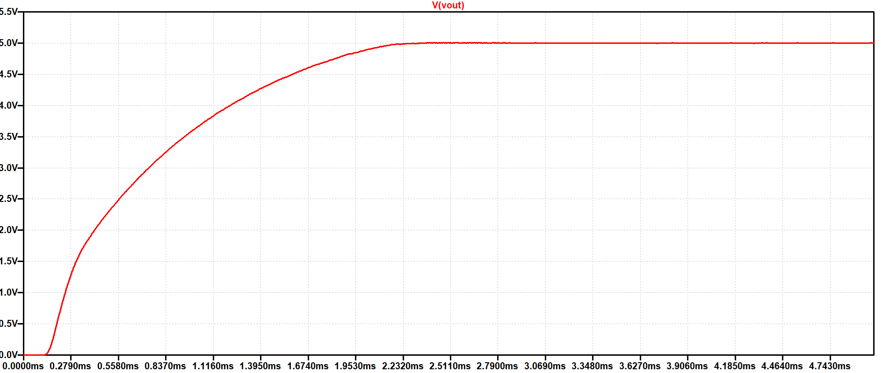

**Clean 5 V output with minimal ripple and smooth transient response. Output voltage settles within regulation band during soft-start and stabilizes at steady-state.**

#### Switch Node Switching Dynamics

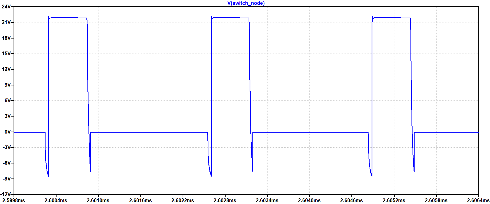

**Synchronous switching between high-side (22 V) and low-side (0 V) at 450 kHz. Dead-time insertion (shown as voltage slew between rail-to-rail) prevents destructive shoot-through current between high-side and low-side MOSFETs.**

#### Power Good Signal

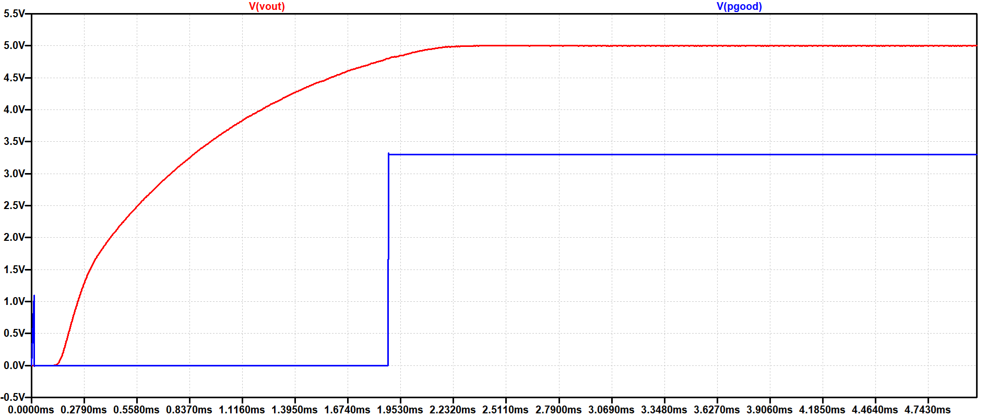

**Output valid signal derived from soft-start ramp control voltage. Indicates when output has settled within regulation band and is safe for downstream circuits to operate.**

---

## Protection Architecture

A multi-tier fault response strategy ensures safe operation across fault scenarios:

| Tier | Mechanism | Response |
|---|---|---|
| **Tier 1: Soft Start** | Controlled ramp-up of reference voltage | Limits inrush current and transient overshoot at power-on |
| **Tier 2: Cycle-by-Cycle Current Limit** | Valley current sensing with low-side resistor | Hard current ceiling each switching cycle |
| **Tier 3: Hiccup Mode** | RC-based fault accumulator | Automatic shutdown and retry under sustained overcurrent |
| **Tier 4: Static Protection** | UVLO, OVP latch, thermal cutoff, reverse-polarity diode | Persistent faults or hazardous conditions |

---

## Circuit Implementation

### Power Stage & Gate Drive

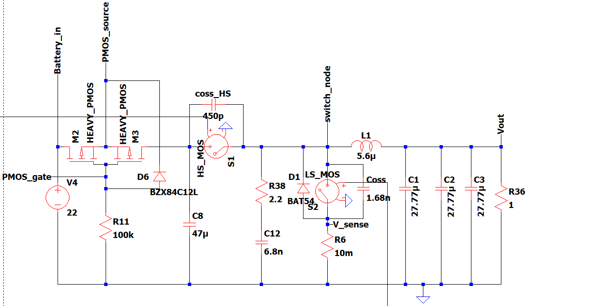

**High-side and low-side MOSFETs** driven by LM5106 gate driver. Current-sense amplifier (INA181) provides valley current feedback. Synchronous rectification eliminates Schottky diode forward drop losses. Dead-time logic prevents shoot-through during switching transitions.


### Oscillator & PWM Generation

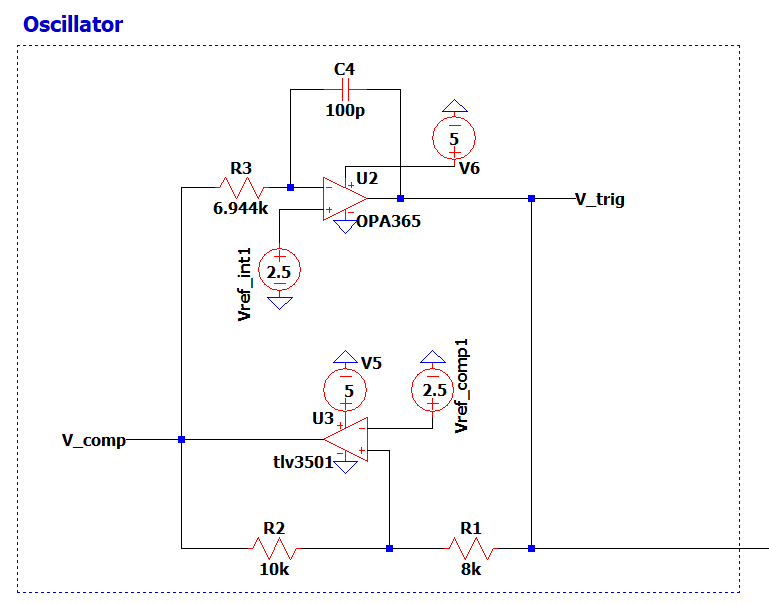

**OPA365 comparator** generates 450 kHz sawtooth ramp. Threshold comparator produces masked PWM synchronized to ramp and compensator feedback signal. Timing reference is stable across input voltage and temperature variations.

**Oscillator Characteristics:**
- Free-running 450 kHz frequency reference
- Ramp amplitude: 4V
- Minimal startup transient; immediate lock at power-on

### Type III Compensator Network

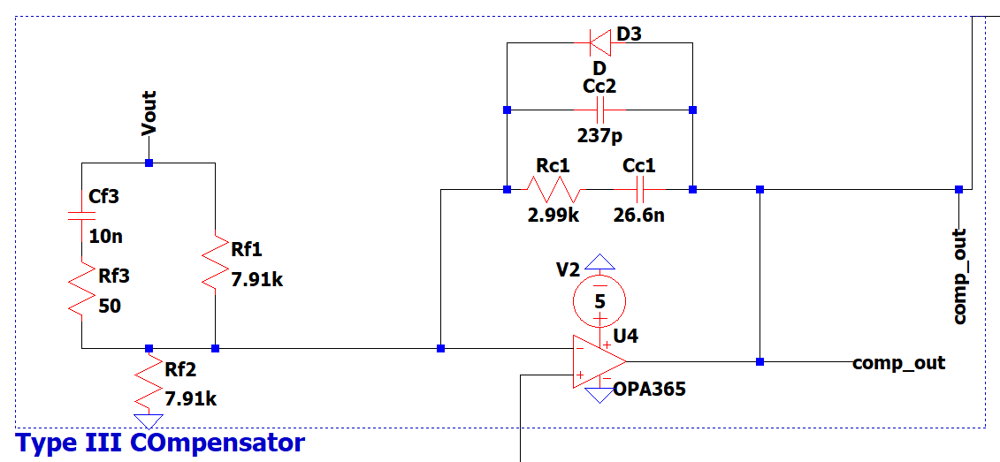

**OPA365 op-amp** with passive RC pole-zero network implements the Type III transfer function: three poles and two zeros, providing the phase boost needed to cross over above the LC resonance. Tuned for bandwidth, phase margin, and DC gain across all three load conditions.

**Compensator Parameters:**
- Poles: one integrator pole at the origin (for zero steady-state error), plus two high-frequency poles — the upper one at 319 kHz, placed below f_sw to attenuate switching ripple
- Zeros: a coincident pair near the LC double pole, providing the phase boost at crossover
- DC gain: set by the feedback divider; the integrator supplies the low-frequency gain
- Measured phase boost: ~150° at crossover (annotated on the Figure 2 plots)

### Soft Start Circuit

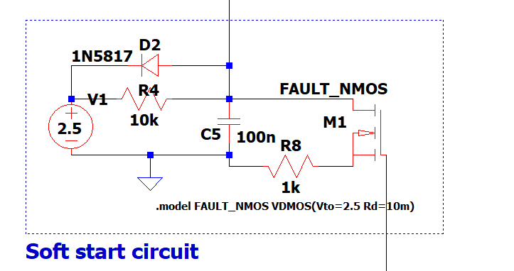

**Controlled ramp-up of V_ref** during startup prevents excessive inrush current and transient overshoot. Soft-start period typically 50–100 ms, limiting di/dt during converter bring-up.

**Protection Features:**
- Prevents input current surge during cold start
- Reduces output voltage overshoot
- Minimizes stress on input supply and filter capacitors

### Valley Current Limiting (SCP/OCP)

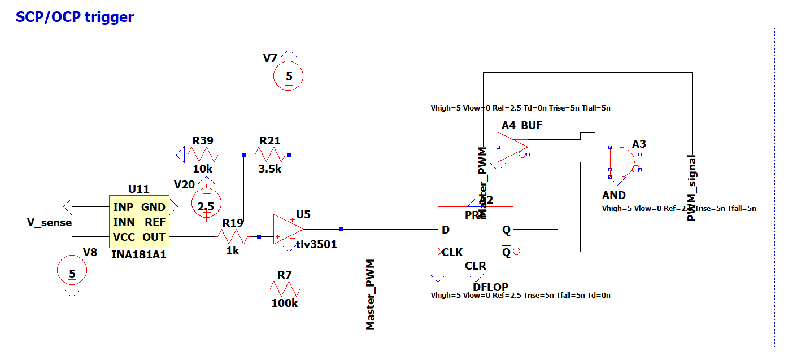

**INA181 current-sense amplifier** measures low-side valley current. Zero-crossing detector (TLV3501) with hysteresis feedback triggers cycle-by-cycle current limiting through D flip-flop logic. Current limit threshold set via programmable resistor network.

**Current Sensing Method:**
- Valley current detection (minimum inductor current each cycle)
- Enables accurate limiting independent of inductor DCR
- Early overcurrent warning before destructive transients

### Over-Temperature Protection

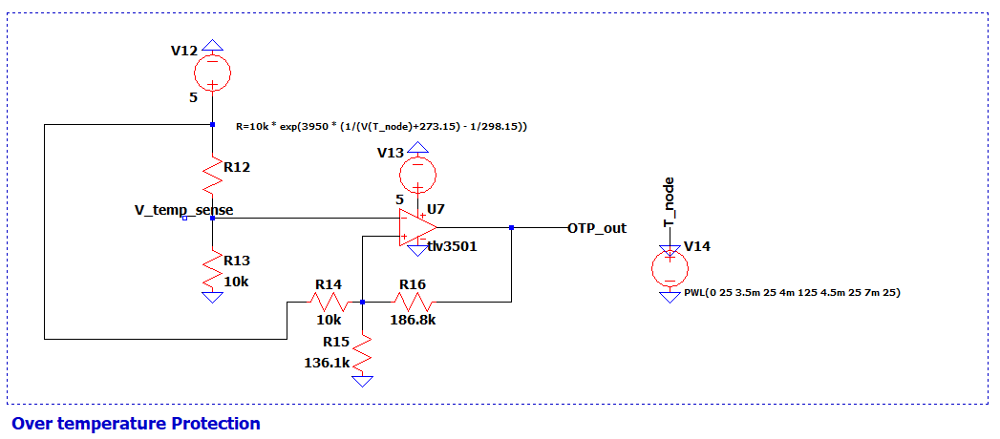

**NTC thermistor** biased with precision resistors. Threshold comparator monitors temperature and disables power stage if junction temperature exceeds safe limit (typically 125–150°C).

**Thermal Management:**
- NTC thermistor mounted near high-power MOSFETs
- Hysteresis prevents oscillation near threshold
- Fault indication sent to external monitoring circuit

### Output Overvoltage Protection

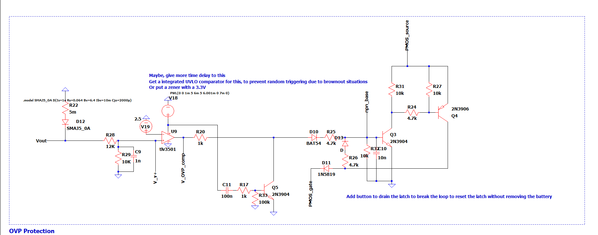

**Latching comparator** monitors output voltage. On overvoltage event, PMOS series disconnect (2N3906) disconnects load from converter. Manual intervention required to restore operation.

**OVP Characteristics:**
- Threshold: 5.5 V (10% above nominal)
- Latch behavior: One-shot trigger, requires reset
- PMOS disconnect: Minimal leakage in fault state

---

## Digital Supervisor (CPLD)

The converter's inner control loop — error amplifier, PWM comparator, ramp — stays analog. What is moving into a CPLD is the **supervisory layer**: the sequencing, fault-latching, and retry logic that is currently built from RC networks, comparators, and discrete flip-flops.

### Why move it

The analog protection blocks work, but each one has costs that digital removes:

| Analog today | Limitation | What digital gives |
|---|---|---|
| **Soft start** — RC ramp on V_ref | Ramp time fixed by an RC pair; tolerance-dependent | Counter-defined ramp, exact and reconfigurable |
| **Hiccup** — RC fault accumulator | Retry interval set by a capacitor; hard to tune, drifts | Deterministic retry count and interval; distinguishes a transient from a persistent fault |
| **Valley current limit** — comparator + D flip-flop | Discrete logic, fixed blanking | Cycle-by-cycle blanking and leading-edge masking in logic |
| **Fault handling** — independent per-block latches | No coordination, no fault priority, no record of what tripped | One state machine with defined priority, plus fault reporting over I²C |

The analog comparators stay — they are the fast path. The CPLD consumes their outputs as trigger flags and owns the decision-making.

### Block interface

`CPLD_super.asy` defines the supervisor as an LTspice block, instantiated in `digital_architecture.asc`. Its pins, grouped by symbol edge:

| Signal | Role (as drawn) |
|---|---|
| `CP_trig` | Current-protection trigger from the valley-current comparator |
| `OVP_trig` | Output overvoltage trigger |
| `OTP_trig` | Over-temperature trigger (NTC comparator) |
| `UVLO_trig` | Input undervoltage-lockout trigger |
| `Osc_in` | Oscillator / ramp-synchronised input from the analog oscillator |
| `Clk_Ext` | External logic clock |
| `En` | Enable |
| `PWM_out` | Gated PWM to the driver stage |
| `G_En` | Gate-drive enable |
| `PGOOD` | Power-good output |
| `Fault_LED` | Fault indication |
| `I2C_SCL`, `I2C_SDA` | Register / telemetry interface |
| `latch_out` | CPLD-driven trip into the shared protection latch |
| `latch_stat` | Latch state read back into the CPLD |

> Pin directions and widths are fixed once the RTL port list is settled.

### The shared protection latch

`latch_out` / `latch_stat` are the most interesting part of the interface, because they make the OVP latch a **shared resource rather than an analog-only block**:

- **The analog comparator can trip it** — the existing fast OVP path, unchanged, still independent of the CPLD.
- **The CPLD can also trip it**, via `latch_out`. This is what gives the supervisor a hard shutdown for conditions that are *slow* rather than fast — the schematic notes a prolonged short-circuit as the motivating case, where cycle-by-cycle limiting is holding but the fault is not clearing.
- **The CPLD reads the latch back** via `latch_stat`, so it can tell whether the latch is still set or the user has drained it with the reset button, and sequence a restart accordingly.

The result is one latch with two trip sources and one observer: analog speed where it matters, digital judgement where it matters, and no second disconnect path to keep consistent.

### Supervisory state machine

`rtl/supervisor.v` implements the sequencing and fault-arbitration FSM — plain Verilog-2001, portable across CPLD vendor toolchains. Four states:

| State | Power stage | Leaves when |
|---|---|---|
| `S_OFF` | disabled | `g_en` high and no fault asserted |
| `S_SS` | enabled, ramping | `SS_done` → `S_RUN`; fault window → `S_HICCUP` |
| `S_RUN` | enabled, regulating | `window_trip` → `S_HICCUP`; any fault → `S_OFF` |
| `S_HICCUP` | disabled | unconditionally → `S_SS` (retry always re-ramps) |

Any of `OTP`, `UVLO`, `latch_state`, `latch_assert`, or `~g_en` forces `S_OFF` from every state.

**Retry always re-ramps.** `S_HICCUP` returns to `S_SS`, never directly to `S_RUN`. A converter that re-enables at full duty into an unresolved fault is how a hiccup mode becomes a destructive oscillation.

`en` is driven from a combinational block gated by the fault inputs directly, so a trip pulls the gate drive low without waiting for a clock edge.

### Verification

`tb/supervisor_tb.sv` is a self-checking testbench: every check is counted, the run ends with a `PASS`/`FAIL` verdict, and a failure calls `$fatal` so the exit status is non-zero and CI notices.

```bash
cd sim && make        # build + run; exit 0 = all checks passed
make wave             # run, then open the VCD
make lint             # Verilator lint pass
```

20 checks across eight groups: reset, soft-start hold, hiccup retry, fault-window entry, `latch_assert` from every state, each individual fault from `S_RUN`, start-up inhibit from `S_OFF`, and the combinational `en` path.

Groups `[2]` and `[5]` are regression tests for two bugs found during bring-up: soft-start exiting after one clock instead of holding for `SS_done`, and `latch_assert` being evaluated only in `S_HICCUP`. Both passed an earlier testbench that checked transitions without checking that states hold.

### Still open

- **Input synchronisers.** Every fault input arrives from an analog comparator with no relationship to the CPLD clock. Sampling them directly into the FSM risks metastability, and lets two bits of one decision disagree for a cycle. Two flip-flops per input fixes it; not yet implemented.
- `SS_done`, `window_trip`, `window_trip_SS`, and `latch_assert` are inputs today — the soft-start counter, fault-window shift register, and strike counter that generate them are the next modules.
- `PGOOD`, `PWM_out`, `Fault_LED`, `Osc_in`, and the I²C register interface are on the `CPLD_super` symbol but not yet in RTL; `latch_out` is the symbol's name for the CPLD-driven latch trip.
- Target device not yet fixed, so no synthesis or fitting results.

---

## LTspice Behavioral Simulation Models

The complete system is modeled in LTspice using switch-based MOSFET abstractions and behavioral voltage/current sources:

### Behavioural models (self-contained — these run out of the box)

- **`behavioural_model_complete.asc`** — Full system integration: oscillator + PWM + compensator + gate drive + protection  
- **`behavioural_model_bare.asc`** — Minimal loop for fast simulation and performance baseline  
- **`compensator_and_plant.asc`** — Open-loop plant + compensator for tuning reference and Bode analysis  
- **`oscillator.asc`** — Standalone 450 kHz timing reference  
- **`OVP_test.asc`** — Overvoltage protection latch and PMOS disconnect behavior  

These use switch-based MOSFET abstractions and behavioural sources, so they simulate fast and depend on nothing outside this repository.

> Vendor `.lib` / `.mod` / `.asy` files are proprietary and excluded by `simulations/.gitignore`, so a device-level model built on real Infineon/TI SPICE models cannot be redistributed here. The behavioural models exist precisely so the loop analysis stays reproducible from a clean clone.

### Digital architecture

- **`digital_architecture.asc`** — Target architecture after moving supervisory and fault-handling logic into a CPLD. See [Digital Supervisor](#digital-supervisor-cpld) below.  
- **`CPLD_super.asy`** — LTspice symbol for the CPLD supervisor block, explicitly un-ignored in `simulations/.gitignore` so the digital schematic stays openable.

### Plot configurations

`behavioural_model_complete.plt`, `compensator_and_plant.plt`, and `oscillator.plt` are saved LTspice waveform-viewer setups (trace selection, axes, panes). LTspice loads them automatically with the matching `.asc`, so the plots open configured rather than blank.

---

## Component Selection & Optimization

### Automated MOSFET Selection Pipeline

A Python-based tool chain automates MOSFET selection against actual drive conditions rather than relying on manual datasheet review.

#### Setup

```bash
cd Mosfet_extraction_pipeline
pip install -r requirements.txt
cp .env.example .env        # then fill in your API keys
```

The pipeline needs DigiKey, Mouser, and Gemini API credentials; `.env.example` lists every variable the scripts read. The committed `.xlsx` outputs are the result of a completed run, so the analysis below can be inspected without re-running any of it.

#### Pipeline Stages

1. **`digikey_mosScraper.py` / `mouser_mosScrapper.py`**  
   Query supplier APIs for candidate MOSFET part numbers and datasheet links → `excel_sheets/mosfet_urls.xlsx`

2. **`gemini_mosfet_data_extractor.py`**  
   Use Gemini API (with Pydantic-validated structured output and API key rotation) to extract:
   - On-resistance (R_ds(on)) at specified V_GS and I_D  
   - Gate charge (Qg, Qsw)  
   - Switching loss parameters  
   - Package footprint data  

3. **`excel_cleanup.py`**  
   Validate and normalize extracted parameters; handle missing or inconsistent data

4. **`JK_optimiser_HS.py` / `JK_optimiser_LS.py`**  
   Score and rank candidates for high-side and low-side positions:
   - Drive conditions: V_IN = 22 V, V_OUT = 5 V, I_out = 5 A  
   - Metrics: the JK optimisation method builds an objective function from switching loss, conduction loss, thermal margin, and gate-drive headroom  
   - Output is **not a single winner but a frequency sweep** — the top five candidates are re-ranked at each of 29 switching frequencies from 100 kHz to 800 kHz, so the ranking can be read at whatever frequency the design settles on

5. **`check_models.py`**  
   Utility to verify available/callable Gemini models

#### Gate Driver Co-Selection

The optimiser scores driver dissipation (`HS_Driver_Heat_W`) alongside MOSFET loss, so the ranking depends on which driver is assumed. The sweep was therefore run twice — once for the **LM5106** and once for the **TI UCC27282** — producing four matrices:

| Matrix | Position | Assumed driver |
|---|---|---|
| `High_side_frequency_optimization_matrix_LM5106.xlsx` | High side | LM5106 |
| `low_side_frequency_matrix_LM5106.xlsx` | Low side | LM5106 |
| `High_side_frequency_optimization_matrix_UCC27282.xlsx` | High side | UCC27282 |
| `low_side_frequency_matrix_UCC27282.xlsx` | Low side | UCC27282 |

**Rankings at the 450 kHz design point:**

| Position / driver | Rank 1 | Total loss | R_ds(on) | Q_sw |
|---|---|---|---|---|
| High side, LM5106 | onsemi NVMYS9D3N06CL | 0.157 W | 9.2 mΩ | 1.8 nC |
| High side, UCC27282 | onsemi NVMYS9D3N06CL | 0.126 W | 9.2 mΩ | 1.8 nC |
| Low side, LM5106 | Infineon BSC014N04LSI | 0.343 W | 1.45 mΩ | 12 nC |
| Low side, UCC27282 | Infineon IAUZN04S7N032 | 0.139 W | 3.25 mΩ | 5.6 nC |

Two things worth reading off this. First, the high-side winner is **driver-independent** — the same part tops both sweeps, so that choice is robust. Second, the UCC27282 sweeps show materially lower loss, and the low-side ranking changes outright between drivers, which is exactly why driver and MOSFET cannot be chosen independently.

**LM5106 was nevertheless selected**, on integration grounds rather than raw loss: programmable dead-time via an external resistor, bootstrap high-side operation with minimal external parts, and an input range covering the full 10.8–22 V spec. The UCC27282 matrices are retained as the documented alternative — if efficiency later outweighs those conveniences, the analysis for that switch is already done.

#### Output Artifacts

- **`mosfet_urls.xlsx`** — Raw scraped part numbers and datasheet links  
- **`cleaned_mosfets.xlsx`** — Extracted and validated parameters  
- **Four `*_frequency_*matrix_*.xlsx` files** — Ranked candidates with loss analysis, per position and per driver (table above)  

### Passive Component Selection

The output capacitor was selected datasheet-first, with DC-bias and temperature derating applied before the value was used in the plant model. The chosen part is a **Kyocera AVX KGM32LR51E476MU** — 47 µF, X5R, 1210, 25 V.


**Why this part:** X5R dielectric in a 1210 package gives the capacitance density needed at 5 A without an electrolytic, and the 25 V rating leaves headroom over the 22 V maximum input for the pre-regulation stage. Availability and lead time were checked at selection time.

#### Derating — the nameplate value is not the design value

| ESR vs Frequency | DC-Bias Derating | Temperature Derating |
|---|---|---|
|  |  | 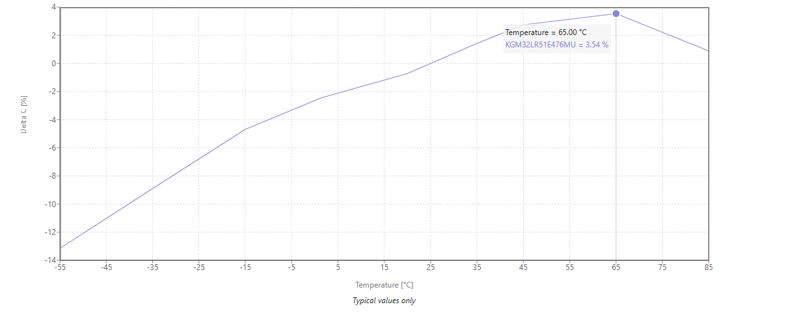 |
| **2.94 mΩ at 451 kHz** — near the ESR minimum, which is why the switching frequency lands where it does. Sets the ESR zero in the plant and dominates output ripple. | **−25.6 % at 5 V DC bias.** The 47 µF nameplate is really **≈ 35 µF** at the operating point — a Class II ceramic effect that moves the LC double pole if ignored. | **+3.5 % at 65 °C**, and −13 % at −55 °C. Small compared to DC bias, but it is the term that shifts the pole as the board heats up. |

**Net effective capacitance at the operating point: ≈ 35–36 µF, not 47 µF.** This derated value — not the marked one — is what feeds the plant transfer function used for compensator tuning. Designing against the nameplate would place the LC double pole roughly 16 % low and quietly eat phase margin at crossover.

---

## PCB Design & Layout

`Sync_buck_convertor/Sync_buck_convertor.PrjPcb` is the Altium Designer project containing schematic and PCB layout.

**Note:** Layout has not started. The `.PrjPcb` is currently a project shell — it references no schematic or PCB documents yet, so opening it in Altium gives an empty project. Schematic capture follows once the digital partition is settled, since it determines the CPLD footprint and which analog protection blocks remain on the board.

---

## Repository Structure

Every figure exists twice: a 300 dpi `.png` under `pictures/` (embedded in this README) and a vector `.pdf` under `graphs_or_pdfs/` (for LaTeX/print). Same plots, two formats.

```
Synchronous_buck_PMIC/
├── Mosfet_extraction_pipeline/          # Automated component sourcing
│   ├── digikey_mosScraper.py            # DigiKey API -> candidate part list
│   ├── mouser_mosScrapper.py            # Mouser API  -> candidate part list
│   ├── gemini_mosfet_data_extractor.py  # Datasheet -> structured params (Gemini)
│   ├── excel_cleanup.py                 # Validate / normalise extracted params
│   ├── JK_optimiser_HS.py               # High-side ranking, 100-800 kHz sweep
│   ├── JK_optimiser_LS.py               # Low-side ranking, 100-800 kHz sweep
│   ├── check_models.py                  # Gemini model availability check
│   ├── requirements.txt
│   ├── .env.example                     # API key names (no secrets)
│   └── excel_sheets/
│       ├── mosfet_urls.xlsx                                   # raw scrape
│       ├── cleaned_mosfets.xlsx                               # validated params
│       ├── High_side_frequency_optimization_matrix_LM5106.xlsx
│       ├── low_side_frequency_matrix_LM5106.xlsx
│       ├── High_side_frequency_optimization_matrix_UCC27282.xlsx
│       └── low_side_frequency_matrix_UCC27282.xlsx
│
├── rtl/                                 # CPLD supervisor RTL (Verilog-2001)
│   └── supervisor.v                     # sequencing + fault arbitration FSM
│
├── tb/
│   └── supervisor_tb.sv                 # self-checking testbench (19 checks)
│
├── sim/
│   └── Makefile                         # make | make wave | make lint
│
├── Sync_buck_convertor/                 # Altium PCB project (layout not started)
│   └── Sync_buck_convertor.PrjPcb
│
├── simulations/
│   ├── behavioural_model_complete.asc   # full system, behavioural
│   ├── behavioural_model_bare.asc       # minimal loop, fast sim
│   ├── compensator_and_plant.asc        # open-loop Bode reference
│   ├── oscillator.asc                   # 450 kHz timing reference
│   ├── OVP_test.asc                     # OVP latch + PMOS disconnect
│   ├── digital_architecture.asc         # target CPLD-supervised architecture
│   ├── CPLD_super.asy                   # CPLD supervisor symbol
│   ├── *.plt                            # saved LTspice plot configurations
│   │
│   ├── MATLAB_code/
│   │   ├── Compensator_tuner_results_and_interpretations.m   # plotting/margins
│   │   ├── Compensator_tuning_session_very_light_load_uA.mat
│   │   ├── Compensator_tuning_session_light_load_(100ma).mat
│   │   ├── Compensator_tuning_session_heavy_load_(5A).mat
│   │   └── Compensator_tuning_session_old.mat                # superseded design
│   │
│   ├── pictures/                        # circuit schematics + PNG analysis plots
│   │   ├── Heavy_loads_5A/              # 5 analysis plots at 5 A
│   │   ├── Light_loads_100mA/           # 5 analysis plots at 100 mA
│   │   ├── Very_light_load_uA/          # 5 analysis plots at uA
│   │   ├── old_vernon_k_tuner_results/  # 5 plots, superseded K-factor design
│   │   ├── Plant.png  Oscillator.png  compensator.png
│   │   ├── Soft_start.png  SCP_OCP.png  OTP.png  OVP.png
│   │   ├── MLCC_cap_selection.png                            # part selection
│   │   ├── MLCC_temp_derating_curve.png                      # temp derating
│   │   ├── KGM32LR51E476MU_output_cap_47uf_ESR.png           # ESR vs freq
│   │   └── KGM32LR51E476MU_47uf_output_cap_DCDerating.png    # DC-bias derating
│   │
│   └── graphs_or_pdfs/                  # vector PDFs (LaTeX) + LTspice captures
│       ├── heavy_load_5A/               # 5 PDF plots at 5 A
│       ├── light_load_100mA/            # 5 PDF plots at 100 mA
│       ├── very_light_load_uA/          # 5 PDF plots at uA
│       ├── old_vernon_k_tuner/          # superseded set + LTspice AC sweeps
│       ├── vout_heavy_load.png          # output voltage waveform
│       ├── switch_node.png              # switch node waveform
│       └── pgood_working.png            # power good waveform
│
├── LICENSE                              # MIT (code / scripts)
├── LICENSE-CERN-OHL-P-2.0.txt           # CERN-OHL-P (hardware)
└── CONTRIBUTING.md
```

---

## Design Methodology & Tools

- **LTspice** — Behavioral simulation and behavioral model for compensator tuning verification  
- **MATLAB** — Plant transfer function analysis, Type III compensator synthesis, Bode and transient analysis  
- **Altium Designer** — Schematic capture, PCB layout, DRC, and design rule enforcement  
- **Python** — MOSFET data extraction pipeline, Excel automation, component optimization, and ranking algorithms  
- **Icarus Verilog + Verilator** — CPLD supervisor simulation and lint; GTKWave for waveforms  

---

## Key Design Considerations

### Multi-Load Compensator Optimization

A Type III compensator optimised only at nominal load can suffer instability or poor transient response at light or heavy loads — this is not hypothetical here, it is what the first iteration of this design actually did (±15 A inductor ringing at light load; see [Design History](#design-history-why-the-compensator-was-retuned)). The current design tunes against three operating points spanning five decades of load current (µA, 100 mA, 5 A) and verifies margins at each: **19.2–19.3 dB gain margin, 61.9–63.9° phase margin, crossover at ~56 kHz.** The tight spread across load is the actual result — the loop behaves the same at 5 A as it does at no load.

### Valley Current Sensing

Valley current sensing (detecting the minimum inductor current each cycle) offers advantages over peak-current sensing:

- **Accuracy:** Cycle-by-cycle limiting independent of inductor DCR variation  
- **Integration:** Natural integration into the PWM feedback loop  
- **Simplicity:** Reduced component count vs. dedicated peak-current comparators  

The implementation uses an INA181 current-sense amplifier and TLV3501 comparator with hysteresis to prevent oscillation near zero-current transitions.

### Gate Driver & Bootstrap Considerations

The LM5106 was selected for these integration properties, over the lower-loss UCC27282 — see [Gate Driver Co-Selection](#gate-driver-co-selection) for the loss comparison behind that trade:

- **Robustness:** High/low-side bootstrap operation with minimal external components  
- **Programmability:** Adjustable dead-time insertion via external resistor network  
- **Wide Range:** Input voltage tolerance (10.8–22 V spans full LM5106 operating range)  
- **Flexibility:** Discrete gate drive control without additional level shifters  

---

## Future Development

Design notes and optimization opportunities are tracked in the LTspice schematics. Planned enhancements include:

- **CPLD supervisor RTL** — *in progress*; migrating soft-start, hiccup, valley-limit and fault arbitration into logic (see [Digital Supervisor](#digital-supervisor-cpld))  
- **Discontinuous/boundary-conduction mode** — planned DEM/ZCD-based mode switching for improved light-load efficiency  
- **PCB parasitic optimization** — gate drive loop inductance reduction, power plane integrity analysis  
- **Thermal analysis** — MOSFET junction temperature modeling under representative load profiles  
- **Hardware validation** — measured efficiency curves and transient performance characterization  

---

## Contribution Policy

This repository is maintained as a static technical portfolio. Issues documenting critical errors or technical corrections are welcome. Pull requests are not being accepted at this time. For details, see `CONTRIBUTING.md`.

---

## License

- **Code** (Python, MATLAB, scripts): **MIT License** — see `LICENSE`  
- **Hardware Design** (schematics, PCB layout): **CERN Open Hardware License v2** — see `LICENSE-CERN-OHL-P-2.0.txt`  

Both licenses are included in the repository root.

---

## Questions & Engagement

For technical questions or design discussions, open an issue. Thank you for exploring this project.
